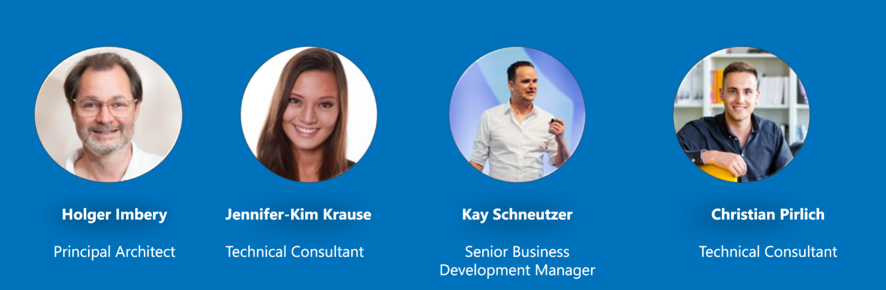

# NTT Germany "Bot in a Day"

{align=right}

## PVA in a Day September 2022
Team Jennifer-Kim Krause, [Holger Imbery](https://the.cognitiveservices.ninja/about/) & [Kay Schneutzer](https://schneutzi-81.github.io/)   

Exercises (Holger Imbery):   

 * [Build a (voice-) bot in a Day](https://the.cognitiveservices.ninja/articles/workshop_PVAinaDay/)

## PVA in a Day August 2022
Team Jennifer-Kim Krause, [Holger Imbery](https://the.cognitiveservices.ninja/about/), [Kay Schneutzer](https://schneutzi-81.github.io/) & Christian Pirlich   

Exercises (Christian Pirlich):   

 * [Overview Topics](exercise_01.md)
 * [Functionality](exercise_02.md)
 * [Integration Options](exercise_03.md)
 * [deliverables](outcome/Aug22/index.md)

### disclamer
[legal](https://services.global.ntt/de-de/legal)   

the domain "bot-in-a-day.de" is registered by [Holger Imbery](https://the.cognitiveservices.ninja/about/)  and NTT Germany is using it for "NTT Germanys - PVA in a Day" Sessions.
